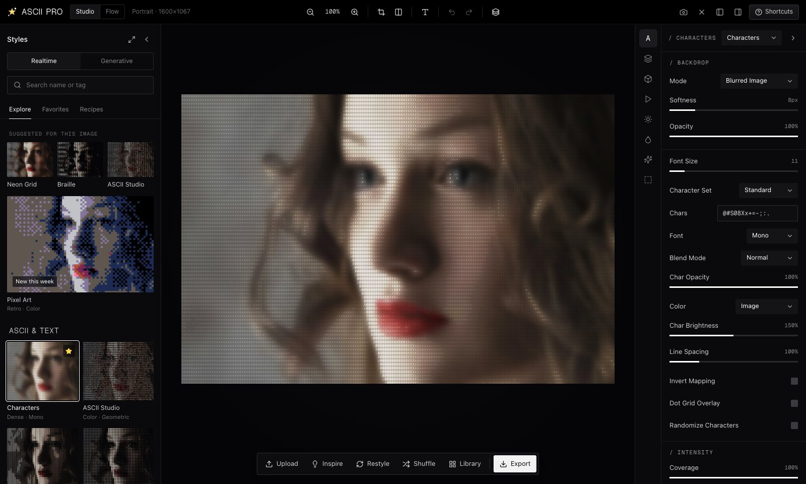
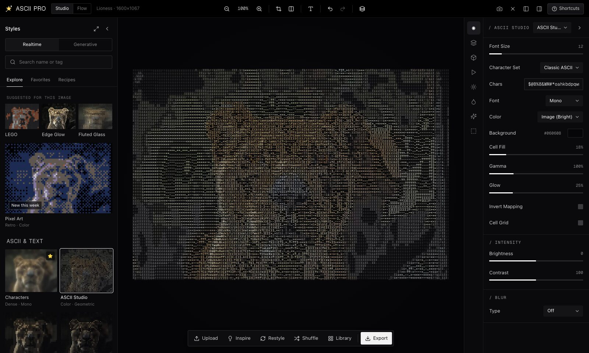
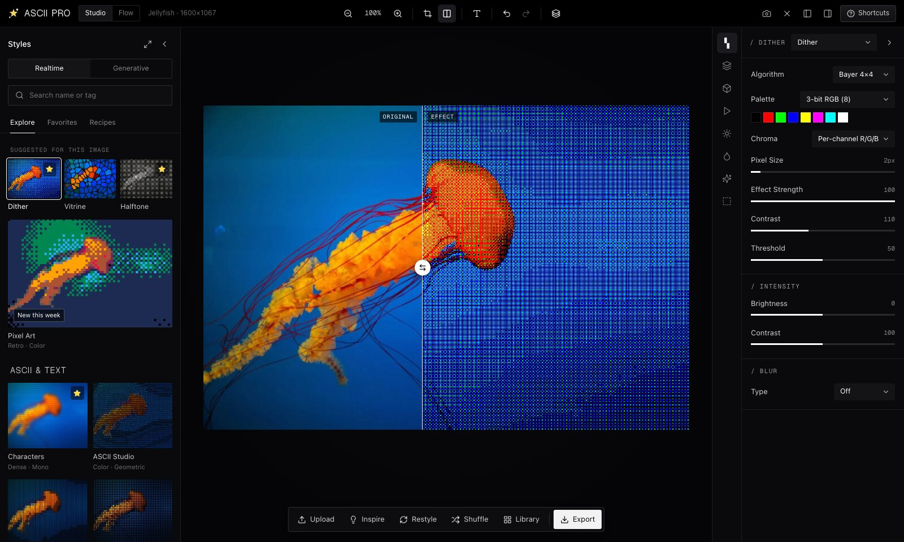
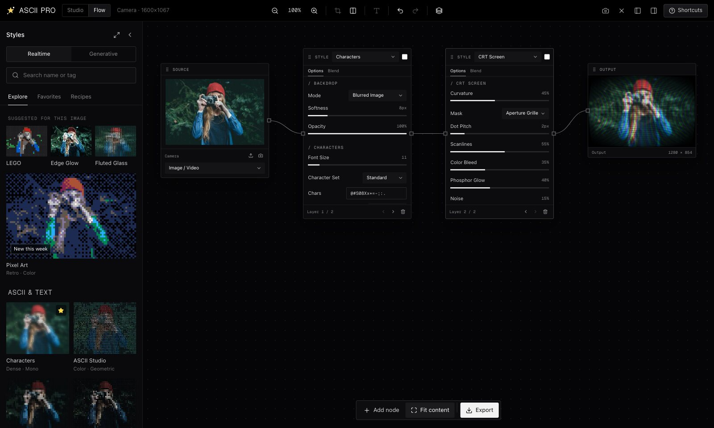
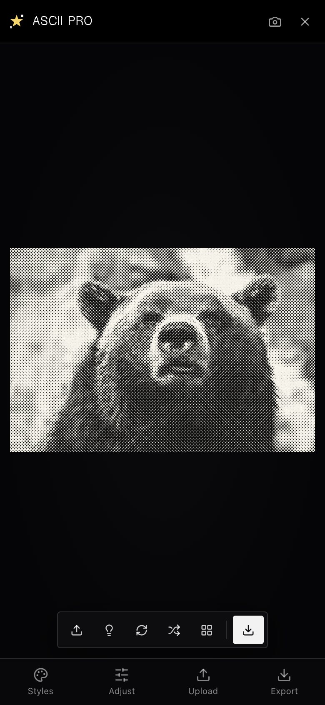
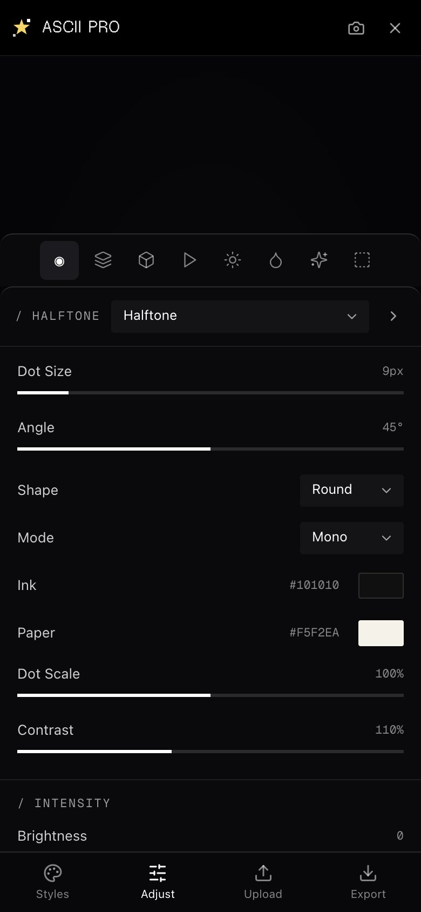
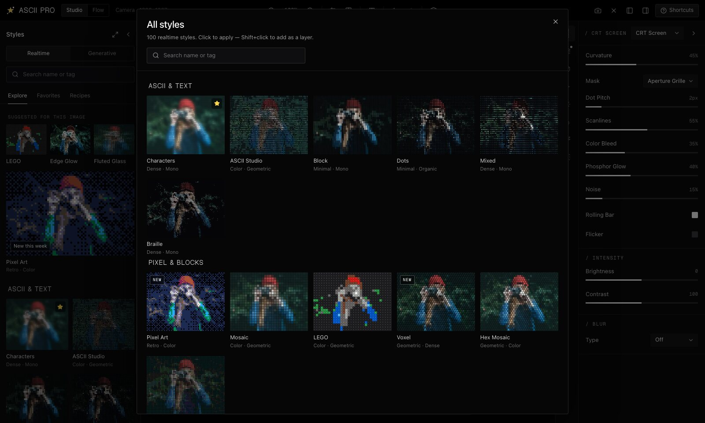

<div align="center">

# ✦ ASCII PRO

**Estudio de imagen ASCII y shaders en tiempo real — 100 estilos, todo en tu navegador.**

[](https://github.com/w3nerick/ASCII-PRO/actions/workflows/ci.yml)


[ascii-pro.vercel.app](https://ascii-pro.vercel.app)



| ASCII Studio | Comparar antes / después | Flow (nodos) |
|---|---|---|
|  |  |  |

| Móvil | Ajustes en móvil | Todos los estilos |
|---|---|---|
|  |  |  |

</div>

## Índice

- [Qué es](#qué-es)
- [Funciones](#funciones)
- [Estructura](#estructura)
- [Inicio rápido](#inicio-rápido)
- [Agregar un estilo](#agregar-un-estilo)
- [Verificación](#verificación)
- [Deploy](#deploy)
- [Documentación](#documentación)
- [Privacidad](#privacidad)
- [Créditos y licencias](#créditos-y-licencias)

## Qué es

ASCII PRO convierte fotos, video, webcam o escenas generativas en arte ASCII y en más de 90 looks de shader
(dither, risograph, halftone, vidrio, glitch, materiales…). Todo corre en la GPU con WebGL2: no hay backend,
no se sube nada. La interfaz tiene dos modos:

- **Studio** — panel de estilos con miniaturas en vivo de *tu* imagen, lienzo central y panel de propiedades.
- **Flow** — editor de nodos `Source → Style → Style → … → Output` para encadenar efectos.

## Funciones

**Fuentes**
- Arrastrar y soltar, pegar del portapapeles (⌘V) o subir imagen / video.
- Webcam en vivo, 12 fotos de muestra (*Inspire*) y 13 generadores (shaders animados y escenas).

**Estilos — 100 en 10 categorías** ([catálogo completo](docs/estilos.md))
- ASCII & Text · Pixel & Blocks · Print & Paper · Geometric · Distort · Blur & Focus · Glitch & Signal ·
  Light & Color · Glass · Material & Texture.
- Cada estilo tiene sus parámetros; los de caracteres permiten 21 sets, texto propio y 5 fuentes.
- **Capas**: apila estilos con opacidad y 10 modos de fusión (Shift+clic en un estilo lo agrega como capa).

**Panel de propiedades**
- Style (backdrop, parámetros, intensidad, 9 tipos de desenfoque), Layers, Depth (Wave, Splay, Color Split, Etch),
  Animation (lluvia tipo Matrix en 8 direcciones, shimmer, velocidad), Lights (foco que sigue al cursor o luces fijas),
  Color (filtros, tinte, saturación, vibrance, tono, temperatura, gradient maps), Post FX (18 efectos) y Mask.

**Herramientas**
- Zoom y paneo (espacio + arrastrar), recorte con proporciones, rotar y voltear.
- Comparador antes/después, capas de texto, máscara pintable (pincel, rectángulo, elipse, borrador).
- Deshacer / rehacer, *Restyle* (re-tira los parámetros), *Shuffle* (estilo al azar).
- **Recetas**: comparte tu look como enlace o código corto; quien lo abre aplica tus ajustes a su propia imagen.
- **Library**: guarda trabajos en el navegador (IndexedDB).

**Exportar**
- PNG, JPG y WebP a 1×–4× (hasta 5120 px), GIF animado, video MP4/WebM, y TXT/HTML para estilos de caracteres.

## Estructura

```
src/
├── engine/                 # Motor WebGL2 (sin React)
│   ├── engine.ts           # Pipeline: pre-ajuste → blur → capas → post FX → composición final
│   ├── passes.ts           # Shaders fijos: pre, blur, bloom, post FX, final (máscara/texto/comparar)
│   ├── shaderLib.ts        # GLSL común + generación automática de uniforms por estilo
│   ├── glyphAtlas.ts       # Atlas de caracteres (canvas → textura con mipmaps)
│   ├── palettes.ts         # Sets de caracteres, paletas, gradient maps, térmicos
│   ├── types.ts            # Tipos: StyleDef, ParamDef, Look, Layer…
│   └── styles/             # 100 estilos, un archivo por categoría + index.ts (registro)
├── state/                  # Estado de la app
│   ├── store.ts            # Store externo + historial (deshacer/rehacer)
│   ├── renderer.ts         # Loop de render, miniaturas, exportaciones
│   ├── source.ts           # Imagen / video / webcam / generadores / muestras
│   ├── recipes.ts          # Códigos de receta + recetas curadas
│   ├── mask.ts · textLayer.ts · library.ts · actions.ts · defaults.ts
├── ui/                     # Componentes React (TopBar, StylesPanel, Stage, Dock, FlowView, modales, overlays)
├── lib/                    # Generadores Lumen (WebGL2), escenas procedurales, codificador GIF
└── styles/studio.css       # Sistema de diseño (tokens, layout, móvil)
public/
├── fonts/                  # Geist, Geist Mono, Geist Pixel (OFL)
└── samples/                # Fotos de muestra (WebP)
scripts/check.mjs           # Verificación del registro de estilos (sin GPU)
dev-shaders.html            # Hoja de contacto de los 100 estilos (QA visual en desarrollo)
docs/                       # Arquitectura, catálogo de estilos, capturas
```

## Inicio rápido

```bash
npm install
npm run dev        # http://localhost:5173
npm run build      # build de producción en dist/
```

QA visual de todos los estilos con el servidor de desarrollo encendido:
`http://localhost:5173/dev-shaders.html?from=0&n=50` (y `from=50`).

## Agregar un estilo

1. Abre el archivo de la categoría en `src/engine/styles/` (por ejemplo `print.ts`).
2. Declara un `StyleDef` con `id`, `name`, `category`, `tags`, `icon`, `params` y `glsl`.
3. El GLSL solo necesita `vec4 effect(vec2 uv)`. Cada parámetro llega como uniform `u_<key>`
   (no hace falta declararlo). Helpers disponibles: `S/Sc/Sl` (muestrear), `tl/fromTl` (píxeles),
   `PX()` (px de diseño → px de render), `cellAvg`, `glyph3`, `gradMap`, `nearestPal`, `sobel`, `voronoi`…
4. Agrégalo al arreglo exportado del archivo y corre `npm run check`.
5. `npm run catalog` actualiza [docs/estilos.md](docs/estilos.md).

Detalles en [docs/arquitectura.md](docs/arquitectura.md).

## Verificación

```bash
npm run check      # registro: ids únicos, claves reservadas, defaults válidos, uniforms usados, showIf, assets
npm run verify     # check + build (lo mismo que corre CI en cada push / PR)
```

## Deploy

Vercel detecta Vite (`vercel.json` incluido). `main` se publica en producción; cada rama genera un preview.

## Documentación

- [docs/arquitectura.md](docs/arquitectura.md) — pipeline de render, estado, miniaturas, exportación.
- [docs/estilos.md](docs/estilos.md) — catálogo de los 100 estilos.

## Privacidad

Cero backend, cero analítica, cero subidas. Las imágenes se procesan en tu GPU y la Library vive en tu navegador.

## Créditos y licencias

- Código: MIT.
- Fuentes Geist / Geist Mono / Geist Pixel © Vercel — SIL Open Font License 1.1 (`public/fonts/OFL.txt`).
- Fotos de muestra de Unsplash (licencia Unsplash) servidas por picsum.photos.
- Generadores Lumen portados de [lumenshaders](https://github.com/Leonxlnx/lumenshaders) (MIT).
- Versión anterior (Canvas 2D) disponible en la etiqueta `v1-classic`.
